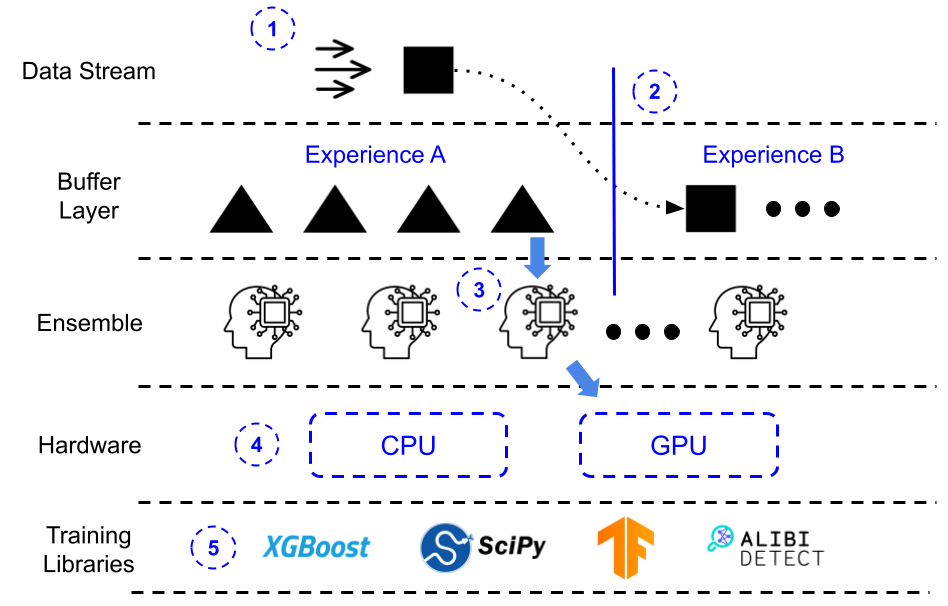

# AdaptiveStream
AdaptiveStream is a framework harnessing capacity scaled Mixture of Expert models (MoE) for continual learning (CL) applications.

We offer end-to-end development of CL pipelines, deployable in $\approx$ 20 lines of code. 

This repository guides the user on how to set up an AdaptiveStream pipeline and train our MoE ensemble on both the Airbnb & CORe50 dataset.

## Architecture
</img>
